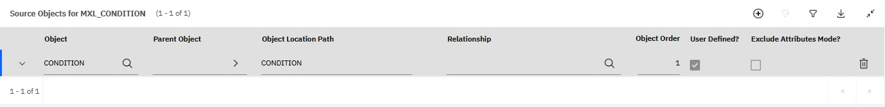

# MxScript

A script manager for IBM Maximo / Maximo Application Suite. This allows management (upload / download / comparison) of automation scripts, application XML and condition expressions from within VS Code

## Features

- Can upload / download / compare / delete scripts , application xmls and condition expressions with the currently selected environment
- Multiple Environment Support
  - Add / edit / delete environments using UI
  - Can switch between environment using UI
  - Provides a treeview for environments
- Ability to fetch logs from currently selected or any other Maximo Manage environment
- Can compare with currently selected or any other Maximo environment
- Adds buttons in status bar for quick switch, upload, download, compare and fetching logs
- MAS Supported
- Can refresh Maximo caches

## Supported Actions

1. [Download from Maximo (picker)](#download-from-maximo)
2. [Download Script(s) from Server](#download-scripts-from-server)
3. [Download Application(s) xml from Server](#download-application-xmls-from-server)
4. [Download Conditions(s) from Server](#download-conditions-from-server)
5. [Download (Update) from Server](#download-update-from-server)
6. [Upload to Server](#upload-to-server) *(Not for application xml)*
7. [Compare with Server](#compare-with-environment-script--xml--condition)
8. [Delete from Server](#delete-this-file-from-server) *(Not for application xml)*
9. [Compare with Another Environment](#compare-with-other-environment)
10. [Fetch Logs from Server](#fetch-logs-from-server) *(only for Manage)*
11. [Manage Environments (Add / Edit / Delete / Set Active)](#managing-environments-in-ui)
11. [Cache Refresh](#cache-refresh)

---
[Requirements](#requirements)

[Configuration](#configuration)

[Status bar shortcuts](#status-bar-shortcuts)

[Tree view actions](#tree-view-actions)

## Actions

### Download from Maximo

#### Activate

Use the command pallete to select this option

#### Functionality

This will show a list of available options to download. This is a high level menu and will present with all the other bulk download options

[Back to Top](#mxscript)

### Download Script(s) from Server

#### Activate

Use the command pallete to select this option

#### Functionality

This will show a select value of the following

- All

- Multiple

In multiple it will show a multi select menu to download scripts

[Back to Top](#mxscript)

### Download Application xml(s) from Server

#### Activate

Use the command pallete to select this option

#### Functionality

This will show a select value of the following

- All

- Multiple

In multiple it will show a multi select menu to download app xmls

[Back to Top](#mxscript)

### Download Condition(s) from Server

#### Activate

Use the command pallete to select this option

#### Functionality

This will show a select value of the following

- All

- Multiple

In multiple it will show a multi select menu to download **SQL based** conditions

[Back to Top](#mxscript)

### Download (Update) from Server

#### Activate

Use the command palette and select this option or use the status basr button for it

#### Functionality

You must have a saved file open for this to work. This downloads the updated automation script or application XML from the server for the opened tab, depending on the file type.

[Back to Top](#mxscript)

### Upload to Server

#### Activate

Use the command palette and select this option or use the status basr button for it

#### Functionality

You must have a saved file open for this to work. This uploads the automation script or condition expression from the opened tab to the server

[Back to Top](#mxscript)

### Compare with Environment (Script / XML / Condition)

#### Activate

Use the command palette and select this option

- Compare with current Environment

- Compare with other Environment

#### Functionality

You must have a saved file open for this to work. 

##### Compare with current Environment

Compares the opened automation script, application XML or condition with the current environment

#### Compare with other Environment

Compares the opened automation script, application XML or condition with the selected environment

[Back to Top](#mxscript)

### Delete this file from Server

#### Activate

Use the command palette and select this option.

#### Functionality

This deletes the automation script or condition on the server

[Back to Top](#mxscript)

### Fetch Logs from Server

#### Activate

Use the command palette or click the "Fetch Logs" status bar button next to the active environment name or click on "Fetch logs"" button in the maximo environments tree view

#### Functionality

Fetches Manage logs via the Maximo stream log end point. When complete, a dedicated editor tab opens (and is reused per environment) titled with the environment name so you can inspect the log output immediately

[Back to Top](#mxscript)

### Managing Environments in UI

You can add multiple environments and switch between them.
Under the explorer webview there is a section for Maximo Environments:

Using the buttons displayed over these environments you can activate, edit and delete them as well

While adding / editing environment you can click on the **Verify Settings** button to check the authentication with the server.

There are two types of environments,

- global (Global are always available in vscode)

- workspace workspace level are only available to the workspace it was created in) 
  
  They have their own icons.

- Active Environment: Uses the $(radio-tower) icon.

- Global Environment: Uses the $(globe) icon.

- Workspace Environment: Uses the $(symbol-folder) icon
  
  
  
  [Back to Top](#mxscript)

### Cache Refresh

It can also refresh the cache present in IBM Maximo. Sometimes needed after adding certain items in maximo. Maximo wont refresh the changes unless those caches are refreshed. e.g. INTOBJECT, MAXPROP etc

Upong triggering this option. You will be presented with a list of cache (might differ for 7.6 or MAS) to be refreshed. You can selected them all, multiple or single.

  
  [Back to Top](#mxscript)

## Status bar shortcuts

When an active environment is set the status bar shows quick-action icons:

- **Active Environment**— It shows the maximo active environment you have selected
- **Fetch Log** — runs `mxscript.fetchLogs` (fetches logs for active environment) — NOTE: Fetch Logs currently works only against Manage (Maximo Application Suite). It is not supported for classic Maximo 7.6 REST endpoints
- **Select and download items from server** — Shows the same download high level menu as [Download from Server](#download-from-server) (opens a quick-pick to choose: scripts, application XML, or conditions)
- **Upload** — Uploads the currently opened file to current environment
- **Download**— Updates the currently open file from current environment
- **Compare**— Compares the currently open file with version at current environment
- **Deletes** — Deletes the currently open file at the current environment

[Back to Top](#mxscript)

## Tree view actions

Each environment in the "Maximo Environments" tree has inline buttons

The buttons call the following commands:

- **Activate (set as active)** → Selects the environment as active
- **Edit**→ Edits the environment
- **Delete**→ Deletes that environment
- **Compare**→ Compares the currently opened file with this environment
- **Fetch Logs**→ Fetches the log from this environment

You can add / refresh an environment or use the tree toolbar to Add / Refresh:

- Add → Adds a new environment
- Refresh → Refreshes an environment

[Back to Top](#mxscript)

## Environment scope and storage

- Global environments are stored in the extension `globalState` and are available across workspaces.

- Workspace environments are stored in `workspaceState` and visible only in that workspace.

- The "active environment" ID is saved in `globalState` under `mxscript.activeEnvironment`.
  
  ### 
  
  [Back to Top](#mxscript)

## Requirements

You should have access to an instance of IBM Maximo which supports the Nextgen rest api

## Configuration

#### Configuring Object Structures

##### Automation Scripts

You must have rights to use an object structure having `AUTOSCRIPT` as its base object.

> There is an object structure `MXAPIAUTOSCRIPT` created by default. You can use it

If your installation does not have this OS, follow these steps to create an object structure:

1. Go to Object Structures
2. Click on `New Object Structure`
3. Give it any name (e.g. `MXSCRIPT`). In Consumed by field enter `INTEGRATION`
4. In the source object table click on New Row. Then in that new row select `AUTOSCRIPT` in object field.
5. Save
6. Grant your user appropriate rights for this object structure

It should look like this:

##### Application XML

You must have rights to use an object structure having `MAXPRESENTATION` as its base object.

> There is no built in object structure for it. You need to create it

If your installation does not have this OS, follow these steps to create an object structure:

1. Go to Object Structures
2. Click on `New Object Structure`
3. Give it any name (e.g. `MXAPPXML`). In Consumed by field enter `INTEGRATION`
4. In the source object table click on New Row. Then in that new row select `MAXPRESENTATION` in object field.
5. Save
6. Grant your user appropriate rights for this object structure

It should look like this:

#### Condition Expression OS

Object Strcuture for condition Expression should be like below

#### Configuring Object Structure Security

If you get this error:

> Error 400: BMXAA9301E - The user of the transaction is not authorized for Object Structure {1}. Configure authorization in the object structure application and grant necessary access to the user

You can either turn off authentication for OS [Turn Off OS Authorization](https://www.ibm.com/support/pages/mif-object-structure-authorization)
or grant authorization for that specific OS [Grant OS Authorization](https://www.ibm.com/support/pages/using-object-structure-security-limit-access-security-groups)

[Back to Top](#mxscript)

## 

Before using this extension you need to add a few settings

### Adding settings in Settings UI

It's also possible to edit these settings in Setting UI. This only supports a single environment.

### Adding the settings in json

You can also edit them in `settings.json` of your project.

This extension contributes the following settings:

| Property Name                                              | Type    | Default  | Description                                                                                       |
| ---------------------------------------------------------- | ------- | -------- | ------------------------------------------------------------------------------------------------- |
| `mxscript.serverSettings.hostname`                         | string  |          | Hostname / IP of Maximo server (e.g. 10.10.12.12 or www.xyz.com)                                  |
| `mxscript.serverSettings.port`                             | number  |          | Maximo port                                                                                       |
| `mxscript.authentication.username`                         | string  | maxadmin | Username for Maximo Authentication                                                                |
| `mxscript.authentication.password`                         | string  | maxadmin | Password for Maximo Authentication                                                                |
| `mxscript.authentication.apikey`                           | string  |          | API key Maximo Authentication                                                                     |
| `mxscript.authentication.authenticationType`               | string  | internal | Type of Authentication (internal, ldap, apikey)                                                   |
| `mxscript.serverSettings.objectStructure`                  | string  | MXSCRIPT | Object Structure to be used for scripts uploading / downloading / deletion                        |
| `mxscript.appxml.objectStructure`                          | string  | MXL_APPS | Object Structure to be used for App XML uploading / downloading                                   |
| `mxscript.serverSettings.httpProtocol`                     | string  | http     | Http protocol (http or https)                                                                     |
| `mxscript.scriptSettings.createPythonFileForJythonScripts` | boolean | true     | Create Jython script in Maximo even if the file in editor is .py                                  |
| `mxscript.scriptSettings.logLevel`                         | string  |          | The log level to set with scripts when creating / updating them (DEBUG, INFO, WARN, ERROR, FATAL) |
| `mxscript.scriptSettings.ignoresslerrors`                  | boolean | false    | Ignore SSL errors                                                                                 |
| `mxscript.scriptSettings.sslcertificate `                  | string  |          | a custom certifcate                                                                               |
| `mxscript.appxml.formatOnDownloadAndCompare`               | boolean | true     | Whether to format XML on download and compare                                                     |

## 

## Troubleshooting and Known Issues

- If your workspace lacks explicit `mxscript.serverSettings.hostname`, but a global active environment exists, the extension will silently apply the active environment settings to the workspace (this is the "silent apply" behavior). If hostname mismatches are detected the user is warned and asked to manage environments.

- "No active Maximo environment" — Set an active environment in the Maximo Environments view or add one via the command palette.

- Hostname mismatch warning — Either update your workspace `mxscript.serverSettings.hostname` or set the correct active environment.

- SSL errors — Toggle `mxscript.scriptSettings.ignoresslerrors` to ignore SSL validation (not recommended for production). It is better to add the SSL certificate in environment settings.

- Fetch Logs not working — Fetch Logs uses Manage APIs and is not available for classic Maximo 7.6 endpoints. Make sure you're pointing to a Manage instance if you need log fetching

- In previous version the OS for apps was a simple one which had only one object in it i.e. MAXPRESENTATION. Now it requires an OS with at least objects in it. MAXAPPS and MAXPRESENTATION. You might need to re create that

- Double check the authentication type, user/pass or the api key provided

- If you encounter any bug then please open an issue at github [repository](https://github.com/ahmednrana/mxscript)

[Back to Top](#mxscript)

## Release Notes

### 1.4.4

- Added option to refresh Maximo cache

### 1.4.0

- Added option to download / upload / compare the condition expressions (sql based only)

### 1.3.5

- Added compare with environment feature - click the compare button next to any environment in the tree view to compare your local script/XML with that environment

### 1.3.4

- Added a Fetch Logs command with a status bar shortcut that opens an environment-specific log viewer tab.

### 1.2.5

Added option to add a custom ssl certificate

### 1.1.8

Fixed a bug where updating an XML wont be reflected in Maximo UI

### 1.1.5

Added logging output channel

### 1.1.0

Fixed script creation error for non english languages

### 1.0.5

Fixed ssl ignore settings

### 1.0.1

Fixed app xml OS not being saved

### 1.0.0

Added support for managing application xml

### 0.9.2

Fixed OS not being read correctly

### 0.7.0

Added option to add multiple environments using UI

### 0.6.5

Added option to ignore SSL based errors

### 0.6.0

Added support for API key

### 0.5.0

Initial release added upload, download, download all and compare with server functions.

**Contact**  
Feel free to reach me at [linkedin](https://www.linkedin.com/in/ranaahmed/) or [Maximomize](https://maximomize.com) or [wordpress](https://maximomize.wordpress.com). I would love to meet fellow maximo consultants

> **Note:** This is work of third party and not an IBM official
