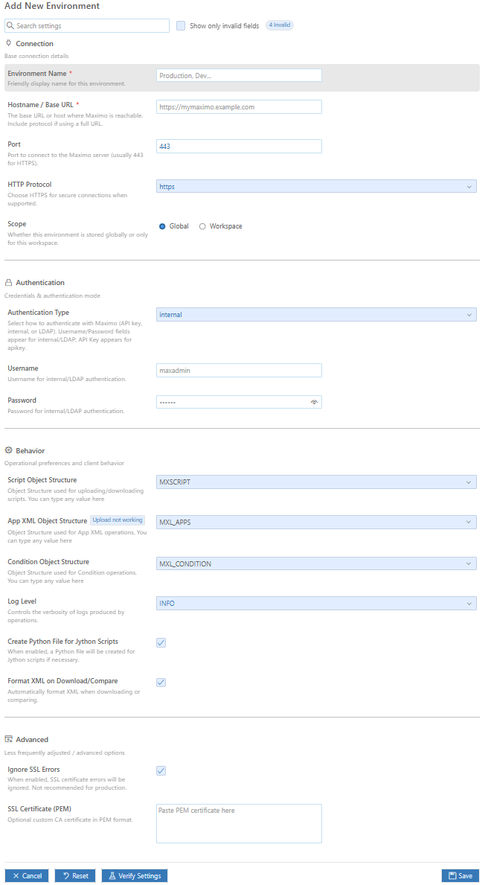

# MxScript

A script manager for IBM Maximo / Maximo Application Suite. This allows simple management (upload / download / comparison) of automation scripts and application XML from within VS Code.

## Features

This extension helps developers using VS Code to manage scripts and application XML for IBM Maximo / Manage.  
It provides unified actions for both Automation Scripts and Application XML.

### Supported Actions

For both Automation Scripts and Application XML, you can:

1. [Download (Update) from Server](#download-update-script--xml-from-server)
2. [Compare with Server](#compare-script--xml-with-server)
3. [Upload to Server](#upload-to-server) *(Not for application xml)*
4. [Download All Scripts from Server](#download-all-scripts-from-server)
5. [Download All Application's xml from Server](#download-all-applicationxml-from-server)
6. [Download All Conditions from Server](#download-all-conditions-from-server)
7. [Delete Script from Server](#delete-script-from-server) *(only for Automation Scripts)*
8. [Compare with Another Environment](#compare-script--xml-with-another-environment)
9. [Fetch Logs from Server](#fetch-logs-from-server) *(only for Manage)*
10. [Manage Environments (Add / Edit / Delete / Set Active)](#managing-environments-in-ui)

---

## Actions

### Download (Update) Script / XML / Condition from Server

#### Activate

Use the command palette and select this option.

#### Functionality

You must have a saved file open for this to work. This downloads the updated automation script or application XML from the server for the opened tab, depending on the file type.

[Back to Top](#mxscript)

## Commands (quick reference)

These are the command IDs exposed by the extension (useful for keybindings or invoking from other extensions):

- `maximoEnvironments.refreshEnvironments` — Refresh the Environments tree view
- `maximoEnvironments.addEnvironment` — Open Add Environment editor
- `maximoEnvironments.editEnvironment` — Edit selected environment (tree)
- `maximoEnvironments.deleteEnvironment` — Delete selected environment (tree)
- `maximoEnvironments.setActiveEnvironment` — Set selected environment as active (tree)
- `maximoEnvironments.compareWithEnvironment` — Compare local file with selected environment (tree)
- `mxscript.upload` — Upload current file to server
- `mxscript.update` — Download/update current file from server
- `mxscript.compare` — Compare current file with server copy
- `mxscript.compareWithEnvironment` — Compare current file with another environment (quick pick)
- `mxscript.downloadall` — Download all automation scripts
- `mxscript.downloadallappxml` — Download all application XML
- `mxscript.downloadallcondition` — Download all condition scripts
- `mxscript.delete` — Delete current file on server
- `mxscript.fetchLogs` — Fetch logs for an environment (accepts an environment tree item or uses active environment)
- `mxscript.manageEnvironments` — Focus the Environments view (or show help)

## Status bar shortcuts

When an active environment is set the status bar shows quick-action icons:

- $(output) Fetch Log — runs `mxscript.fetchLogs` (fetches logs for active environment) — NOTE: Fetch Logs currently works only against Manage (Maximo Application Suite). It is not supported for classic Maximo 7.6 REST endpoints.
- $(arrow-up) Upload — runs `mxscript.upload` (clicks from the status bar pass an argument `{ source: "statusbar" }`)
- $(arrow-down) Download — runs `mxscript.update` (status bar invocation passes `{ source: "statusbar" }`)
- $(compare-changes) Compare — runs `mxscript.compare` (status bar invocation passes `{ source: "statusbar" }`)

Note: status‑bar invocations include a provenance argument so the command handler can detect that the action originated from the status bar. This allows handlers to change behavior (UI flow) when invoked from the status bar.

## Tree view actions

Each environment in the "Maximo Environments" tree has inline buttons. The buttons call the following commands:

- Activate (set as active) → `maximoEnvironments.setActiveEnvironment`
- Edit → `maximoEnvironments.editEnvironment`
- Delete → `maximoEnvironments.deleteEnvironment`
- Compare → `maximoEnvironments.compareWithEnvironment`

You can add / refresh an environment or use the tree toolbar to Add / Refresh:
- Add → `maximoEnvironments.addEnvironment`
- Refresh → `maximoEnvironments.refreshEnvironments`

### Buttons shown over each environment

The tree view shows inline buttons above each environment for quick actions. The table below documents the button/icon, the command invoked, and what it does.

| Icon | Command | Functionality |
| ---: | :----- | :------------ |
| $(radio-tower) Active | `maximoEnvironments.setActiveEnvironment` | Sets the environment as the active environment for the extension (updates status bar and enables status-bar shortcuts). |
| $(pencil) Edit | `maximoEnvironments.editEnvironment` | Opens the environment editor webview pre-populated with the environment details (allows changing hostname, credentials, scope). |
| $(trash) Delete | `maximoEnvironments.deleteEnvironment` | Prompts for confirmation then deletes the environment from storage (global or workspace). |
| $(compare-changes) Compare | `maximoEnvironments.compareWithEnvironment` | Compares the currently open file with the selected environment's server copy (downloads and runs comparison). |
| $(output) Fetch Log | `mxscript.fetchLogs` | Fetches logs for the selected environment and opens the log viewer. NOTE: Fetch Logs uses Manage APIs and is not supported for classic Maximo 7.6 endpoints. |

When a button is clicked the corresponding command receives a tree item context so the handler knows which environment to operate on.

## Environment scope and storage

- Global environments are stored in the extension `globalState` and are available across workspaces.
- Workspace environments are stored in `workspaceState` and visible only in that workspace.
- The "active environment" ID is saved in `globalState` under `mxscript.activeEnvironment`.
- If your workspace lacks explicit `mxscript.serverSettings.hostname`, but a global active environment exists, the extension will silently apply the active environment settings to the workspace (this is the "silent apply" behavior). If hostname mismatches are detected the user is warned and asked to manage environments.

- "No active Maximo environment" — Set an active environment in the Maximo Environments view or add one via the command palette.
- Hostname mismatch warning — Either update your workspace `mxscript.serverSettings.hostname` or set the correct active environment.
- SSL errors — Toggle `mxscript.scriptSettings.ignoresslerrors` to ignore SSL validation (not recommended for production). It is better to add the SSL certificate in environment settings.
- Fetch Logs not working — Fetch Logs uses Manage APIs and is not available for classic Maximo 7.6 endpoints. Make sure you're pointing to a Manage instance if you need log fetching.

## Contributing

PRs and issues welcome — please open issues for bugs or feature requests and follow the standard GitHub flow.

### Compare with current Environment (Script / XML / Condition)

#### Activate

Use the command palette and select this option.

#### Functionality

You must have a saved file open for this to work. This downloads the updated automation script or application XML for the opened tab and compares it.

[Back to Top](#mxscript)

### Compare Another Environment (Script / XML / Condition)

#### Activate

Click the compare button ($(compare-changes) icon) next to any environment in the Maximo Environments tree view.

#### Functionality

You must have a saved file open for this to work. This downloads the automation script or application XML from the selected environment and compares it with your local file. Useful for comparing the same script/XML across different environments (dev, test, prod).

[Back to Top](#mxscript)

### Upload to Server (Script / XML / Condition)

#### Activate

Use the command palette and select this option.

#### Functionality

You must have a saved file open for this to work. This uploads the automation script or application XML (application XML currently not working) from the opened tab to the server.

[Back to Top](#mxscript)

### Download All Scripts from Server

#### Activate

Use the command palette and select this option.

#### Functionality

This downloads all automation scripts from the Maximo server to the folder you select.

[Back to Top](#mxscript)

### Download All Application's xml from Server

#### Activate

Use the command palette and select this option.

#### Functionality

This downloads all application XML files from the Maximo server to the folder you select.

[Back to Top](#mxscript)

### Delete this file from Server (Script / Condition)

#### Activate

Use the command palette and select this option.

#### Functionality

This deletes the automation script on the server.

[Back to Top](#mxscript)

### Fetch Logs from Server

#### Activate

Use the command palette or click the "Fetch Log" status bar button next to the active environment name.

#### Functionality

Displays live progress while the extension downloads the latest Manage logs via the Maximo logging service. When complete, a dedicated editor tab opens (and is reused per environment) titled with the environment name so you can inspect the log output immediately.

[Back to Top](#mxscript)

---

## Requirements

You should have access to an instance of IBM Maximo to manage scripts and application XML.

#### Configuring Object Structures

##### Automation Scripts

You must have rights to use an object structure having `AUTOSCRIPT` as its base object.

> There is an object structure `MXAPIAUTOSCRIPT` created by default. You can use it

If your installation does not have this OS, follow these steps to create an object structure:

1. Go to Object Structures
2. Click on `New Object Structure`
3. Give it any name (e.g. `MXSCRIPT`). In Consumed by field enter `INTEGRATION`
4. In the source object table click on New Row. Then in that new row select `AUTOSCRIPT` in object field.
5. Save
6. Grant your user appropriate rights for this object structure

It should look like this:

##### Application XML

You must have rights to use an object structure having `MAXPRESENTATION` as its base object.

> There is no built in object structure for it. You need to create it

If your installation does not have this OS, follow these steps to create an object structure:

1. Go to Object Structures
2. Click on `New Object Structure`
3. Give it any name (e.g. `MXAPPXML`). In Consumed by field enter `INTEGRATION`
4. In the source object table click on New Row. Then in that new row select `MAXPRESENTATION` in object field.
5. Save
6. Grant your user appropriate rights for this object structure

It should look like this:

#### Configuring Object Structure Security

If you get this error:

> Error 400: BMXAA9301E - The user of the transaction is not authorized for Object Structure {1}. Configure authorization in the object structure application and grant necessary access to the user

You can either turn off authentication for OS [Turn Off OS Authorization](https://www.ibm.com/support/pages/mif-object-structure-authorization)
or grant authorization for that specific OS [Grant OS Authorization](https://www.ibm.com/support/pages/using-object-structure-security-limit-access-security-groups)

## Extension Settings

Before using this extension you need to add a few settings.

### Managing Environments in UI

You can add multiple environments and switch between them.
Under the explorer webview there is a section for Maximo Environments:

You can easily add multiple environments:

Using the buttons displayed over these environments you can activate, edit and delete them as well:

There are two types of environments, global or workspace. Global are always available in vscode while the workspace level are only available to the workspace it was created in. They have their own icons.

- Active Environment: Uses the $(radio-tower) icon.
- Global Environment: Uses the $(globe) icon.
- Workspace Environment: Uses the $(symbol-folder) icon.

### Adding settings in Settings UI of vscode

It's also possible to edit these settings in Setting UI. This only supports a single environment.

### Adding the settings in json

You can also edit them in `settings.json` of your project.

This extension contributes the following settings:

| Property Name                                              | Type    | Default  | Description                                                                                       |
| --- | --- | --- | --- |
| `mxscript.serverSettings.hostname`                         | string  |          | Hostname / IP of Maximo server (e.g. 10.10.12.12 or www.xyz.com)                                  |
| `mxscript.serverSettings.port`                             | number  |          | Maximo port                                                                                       |
| `mxscript.authentication.username`                         | string  | maxadmin | Username for Maximo Authentication                                                                |
| `mxscript.authentication.password`                         | string  | maxadmin | Password for Maximo Authentication                                                                |
| `mxscript.authentication.apikey`                           | string  |          | API key Maximo Authentication                                                                     |
| `mxscript.authentication.authenticationType`               | string  | internal | Type of Authentication (internal, ldap, apikey)                                                   |
| `mxscript.serverSettings.objectStructure`                  | string  | MXSCRIPT | Object Structure to be used for scripts uploading / downloading / deletion                        |
| `mxscript.appxml.objectStructure`                          | string  | MXL_APPS | Object Structure to be used for App XML uploading / downloading                                   |
| `mxscript.serverSettings.httpProtocol`                     | string  | http     | Http protocol (http or https)                                                                     |
| `mxscript.scriptSettings.createPythonFileForJythonScripts` | boolean | true     | Create Jython script in Maximo even if the file in editor is .py                                  |
| `mxscript.scriptSettings.logLevel`                         | string  |          | The log level to set with scripts when creating / updating them (DEBUG, INFO, WARN, ERROR, FATAL) |
| `mxscript.scriptSettings.ignoresslerrors`                  | boolean | false    | Ignore SSL errors                                                                                 |
| `mxscript.scriptSettings.sslcertificate `                  | string  |          | a custom certifcate                                                                               |
| `mxscript.appxml.formatOnDownloadAndCompare`               | boolean | true     | Whether to format XML on download and compare                                                     |

## Known Issues
In previous version the OS for apps was a simple one which had only one object in it i.e. MAXPRESENTATION. Now it requires an OS with at least objects in it. MAXAPPS and MAXPRESENTATION. You might need to re create that.

Double check the authentication type, user/pass or the api key provided.  
If you encounter any bug then please open an issue at github [repository](https://github.com/ahmednrana/mxscript)

## Release Notes

### 1.4.0

- Added option to download / upload / compare the condition expressions (sql based only)

### 1.3.5

- Added compare with environment feature - click the compare button next to any environment in the tree view to compare your local script/XML with that environment

### 1.3.4

- Added a Fetch Logs command with a status bar shortcut that opens an environment-specific log viewer tab.

### 1.2.5

Added option to add a custom ssl certificate

### 1.1.8

Fixed a bug where updating an XML wont be reflected in Maximo UI

### 1.1.5

Added logging output channel

### 1.1.0

Fixed script creation error for non english languages

### 1.0.5

Fixed ssl ignore settings

### 1.0.1

Fixed app xml OS not being saved

### 1.0.0

Added support for managing application xml

### 0.9.2

Fixed OS not being read correctly

### 0.7.0

Added option to add multiple environments using UI

### 0.6.5

Added option to ignore SSL based errors

### 0.6.0

Added support for API key

### 0.5.0

Initial release added upload, download, download all and compare with server functions.

**Contact**  
Feel free to reach me at [linkedin](https://www.linkedin.com/in/ranaahmed/) or [Maximomize](https://maximomize.com) or [wordpress](https://maximomize.wordpress.com). I would love to meet fellow maximo consultants

> **Note:** This is work of third party and not an IBM official
